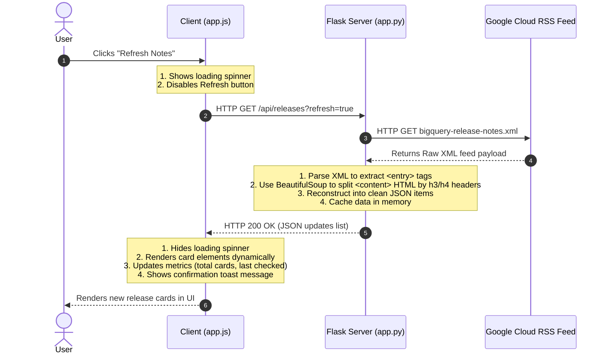

# BigQuery Release Notes Dashboard - Architecture & Deep Dive

This document explains the architecture, feature set, client-server split, and request-response flow of the BigQuery Release Notes Dashboard application.

---

## 1. Project Overview & Features

The web application tracks, parses, and displays BigQuery updates dynamically with sharing features:
* **Granular Feed Parsing**: Splits daily bulk release updates into individual feature/issue cards.
* **Smart Filter & Search**: Allows real-time search queries and category filtering (Features, Changed, Deprecated, Issues) on the client side.
* **X/Twitter Web Intent Integration**: Includes a custom compose modal with live character limit tracking (280 characters), quick hashtag chips, and a real-time mock tweet visual preview.
* **Modern Interface**: Designed using CSS Variables, custom glassmorphism components, animated loaders, and responsive layouts.

---

## 2. Server vs. Client Breakdown

```
 ┌──────────────────────────────────────────────────────────┐
 │                       CLIENT SIDE                        │
 │         HTML5 (Structure) | Vanilla CSS (Styles)         │
 │                  JavaScript (App Logic)                  │
 └────────────────────────────┬─────────────────────────────┘
                              │ HTTP Requests
                              ▼
 ┌──────────────────────────────────────────────────────────┐
 │                       SERVER SIDE                        │
 │         Flask Web Server (API Gateway / Router)          │
 │              BeautifulSoup & ElementTree (Parsers)       │
 └────────────────────────────┬─────────────────────────────┘
                              │ Outgoing Requests
                              ▼
 ┌──────────────────────────────────────────────────────────┐
 │                 GOOGLE CLOUD PLATFORM                    │
 │               BigQuery XML Release Feed                  │
 └──────────────────────────────────────────────────────────┘
```

### Server-Side (`app.py`)
Responsible for routing, XML parsing, and heading-based extraction logic:
* **Libraries**: `Flask`, `xml.etree.ElementTree`, `BeautifulSoup` (`bs4`), and `urllib.request`.
* **Atom XML Fetcher**: Fetches raw XML feed from `https://docs.cloud.google.com/feeds/bigquery-release-notes.xml`.
* **BeautifulSoup Splitter**: Google Cloud publishes multiple updates grouped under a single date tag. The server parses the raw HTML tag text, searches for `<h3>`/`<h4>` header blocks, and splits the payload into individual, typed updates.
* **In-Memory Cache**: Caches fetched updates to ensure quick loads, offering a `?refresh=true` endpoint parameter to bypass cache and fetch fresh results.

### Client-Side (`templates/index.html`, `styles.css`, `app.js`)
Handles UI rendering, search logic, styling, and social integrations:
* **Dynamic Grid rendering**: Submits an asynchronous request to `/api/releases`, parses JSON payload, and appends structured cards to the DOM.
* **Real-time Filters**: Re-renders cards based on the text search bar input or selected category buttons.
* **Tweet Modal**: Calculates character usage (blocking intent generation if it exceeds 280 characters), handles quick hashtag appending, and mirrors the input inside an X/Twitter-themed HTML card.

---

## 3. Sample Flow: Refreshing Release Notes

When you click the **"Refresh Notes"** button, the following request-response process is executed:



### Sample HTTP Payloads

#### 1. API Request (Client to Flask Server)
```http
GET /api/releases?refresh=true HTTP/1.1
Host: 127.0.0.1:5000
Accept: application/json
```

#### 2. API Response (Flask Server to Client)
```json
{
  "success": true,
  "last_fetched": "2026-06-16 14:31:00",
  "updates": [
    {
      "id": "0_0",
      "date": "June 15, 2026",
      "updated": "2026-06-15T00:00:00-07:00",
      "type": "Feature",
      "html": "<p>Use Gemini Cloud Assist to analyze your SQL queries and receive recommendations...</p>",
      "text": "Use Gemini Cloud Assist to analyze your SQL queries and receive recommendations...",
      "link": "https://docs.cloud.google.com/bigquery/docs/release-notes#June_15_2026"
    }
  ]
}
```
